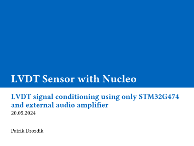

# LVDT Sensor with NUCLEO-G474RE

A complete implementation of Linear Variable Differential Transformer (LVDT) signal conditioning using STM32G474 microcontroller and external audio amplifier, eliminating the need for dedicated LVDT signal conditioner chips.

## Project Overview

This project demonstrates how to drive and process signals from an LVDT sensor using the NUCLEO-G474RE development board. Instead of using dedicated LVDT signal conditioners (like AD598, AD698, TI PGA970), this implementation leverages the STM32G474's advanced peripherals to achieve high-performance position sensing.

### Key Features

- **10 kHz sine wave generation** for LVDT primary coil excitation
- **120 kSa/s dual-channel ADC sampling** of secondary coils
- **Real-time signal processing** using Goertzel algorithm with CORDIC acceleration
- **OLED display** showing current measurements and system status
- **UART data logging** for CSV export and analysis
- **±27.5 mm linear measurement range** (with the custom made coil)

## Hardware Components

### STM32G474 Nucleo Board
- 32-bit ARM Cortex-M4 core (up to 170 MHz)
- 5x 12-bit ADCs (4 Msps)
- 3x external DAC channels
- 2x 8-channel DMA controllers
- CORDIC trigonometric accelerator

### External Components
- **LM4889 Audio Amplifier** - Powers primary coil with low output impedance
- **128x64 OLED Display** - Real-time data visualization
- **Custom LVDT Sensor** - Homemade transformer with movable ferrite core
- **Signal Conditioning Circuit** - Voltage dividers and blocking capacitors

## Technical Specifications

| Parameter | Value |
|-----------|-------|
| Driving Signal Frequency | 10 kHz |
| DAC Frequency | 1 MHz |
| DAC Resolution | 12-bit |
| ADC Sampling Frequency | 120 kSa/s |
| ADC Resolution | 12-bit |
| ADC Buffer Length | 2 kSa |
| Calculation Update Rate | ~110 Hz |
| Linear Range | ±27.5 mm |
| Length Coefficient (k) | 2.32 mm |

## System Architecture

### Signal Generation (Primary Coil)
- Sine table stored in FLASH memory
- TIM6 generates 1 MHz interrupts for DAC updates
- DMA1 CH3 transfers sine wave data to DAC1 CH1
- LM4889 amplifier removes DC component and provides power amplification

### Signal Acquisition (Secondary Coils)
- TIM7 generates 120 kHz interrupts for ADC triggering
- ADC1 & ADC2 in simultaneous mode sample both secondary coils
- DMA1 CH1 transfers data to 2 kB RAM buffer
- Interrupt handler processes data in 1 kB chunks

### Signal Processing
- **Goertzel Algorithm** calculates amplitude at 10 kHz frequency
- **CORDIC Accelerator** computes magnitude from real/imaginary components
- **Core Position Calculation**: `x_core = k × (A₁ - A₂) / (A₁ + A₂)`

## Hardware Setup

### Circuit Connections

#### Primary Coil Driver
```
STM32 DAC1_CH1 → C3 (blocking cap) → LM4889 → Primary Coil
```

#### Secondary Coil Measurement
```
Secondary Coil 1 → C1 (blocking cap) → R1/R2 (voltage divider) → STM32 ADC1_IN1
Secondary Coil 2 → C2 (blocking cap) → R3/R4 (voltage divider) → STM32 ADC2_IN1
```

#### OLED Display (I2C)
```
STM32 I2C1_SCL → OLED SCL
STM32 I2C1_SDA → OLED SDA
```

### Pin Configuration
- **DAC1_CH1**: PA4 - Primary coil drive signal
- **ADC1_IN1**: PA0 - Secondary coil 1 input
- **ADC2_IN1**: PA1 - Secondary coil 2 input
- **I2C1_SCL**: PB8 - OLED display clock
- **I2C1_SDA**: PB9 - OLED display data
- **USART1_TX**: PA9 - Data output

## Software Architecture

### Main Components

1. **Signal Generation Module**
   - Sine wave table generation
   - DMA-based DAC control
   - Timer synchronization

2. **Data Acquisition Module**
   - Dual ADC configuration
   - DMA buffer management
   - Interrupt handling

3. **Signal Processing Module**
   - Goertzel algorithm implementation
   - CORDIC magnitude calculation
   - Position computation

4. **Display Module**
   - OLED graphics and text rendering
   - Real-time data visualization
   - Menu system

5. **Communication Module**
   - UART data transmission
   - CSV format output

## Usage Instructions

### Building and Flashing
1. Open project in your preferred IDE (this project was developed in VS Code with CMake, using the STM32CubeMX generated code as a base)
2. Build the project using provided cmake
3. Flash to NUCLEO-G474RE board

### Operation
1. Connect LVDT sensor to the breadboard circuit
2. Power on the NUCLEO board
3. Monitor real-time measurements on OLED display
4. Connect to PC via USB-UART converter for data logging
5. Errors, warnings and debug messages are logged via UART linked to the Nucleo's built-in ST-LINK USB interface

### Display Interface
The OLED display shows:
- **Driving frequency**: 10.00 kHz
- **Sampling frequency**: 120.0 kSa/s
- **Secondary coil amplitudes**: A₁, A₂
- **Core position**: Current displacement in mm
- **Visual position indicator**: Horizontal slider

### Data Output
CSV data is transmitted via UART (115200 baud) with format:
```
timestamp,amplitude1,amplitude2,position_mm
```

## Performance Results

- **Linear Range**: ±27.5 mm with good linearity
- **Update Rate**: >100 Hz for real-time applications
- **Resolution**: Limited by 12-bit ADC and signal conditioning
- **Stability**: Consistent measurements with minimal drift

## Mathematical Background

The LVDT operates on the principle of electromagnetic induction. Core position is calculated using:

```
x_core = k × (A₁ - A₂) / (A₁ + A₂)
```

Where:
- `x_core`: Core position relative to center
- `k`: Length coefficient (2.32 mm for this sensor)
- `A₁, A₂`: Amplitudes of secondary coil signals at driving frequency
<!-- TODO: actually update this or delete it
## Project Structure

```
├── Core/
│   ├── Inc/           # Header files
│   └── Src/           # Source files
├── Drivers/           # STM32 HAL drivers
├── docs/
│   ├── presentation/  # Project presentation
│   ├── poster/        # Academic poster
│   └── README.md      # This file
└── Debug/             # Build output
```
-->

## Possible Improvements

- Enhanced coil winding for better sensitivity
- Temperature compensation algorithms
- Wireless data transmission capabilities
- Real-time PC visualization software
- Miniaturization for portable applications

## Academic Context

This project was developed as semestral work for courses:
- **B3B38SME1** - Sensors and Measurements
- **B3B38LPE1** - Laboratories of Industrial Electronics

**Faculty of Electrical Engineering**  
**Czech Technical University in Prague**

<details>
<summary>Other Documenting Materials - PDFs</summary>

|Description|Preview and link|
|:--|:--:|
| Short 4 page presentation outlining the basics of LVDT sensor principle and introducing this project | [](presentation/presentation-LVDT_with_NucleoG474RE.pdf) |
| 2 page academic poster summarizing the project for conference presentation | [](poster/poster-LVDT_with_NucleoG474RE.pdf) |

</details>

## Author

**Patrik Drozdík**  
Faculty of Electrical Engineering, CTU Prague

---

*This implementation demonstrates that modern microcontrollers can effectively replace dedicated LVDT signal conditioner chips while providing additional flexibility for custom signal processing and system integration.*
